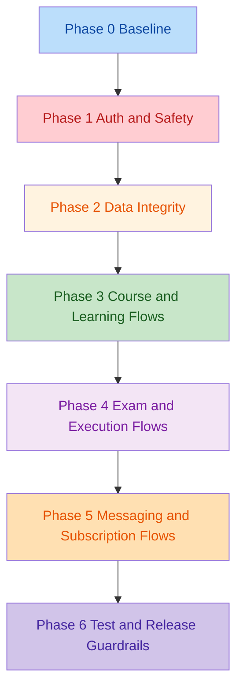

# CodeMaster Restructure Plan

Date: 2026-06-19

## Goal

Stabilize the current product before adding more features. The repo already has strong surface-area coverage across learning, exams, messaging, AI, subscriptions, and teacher tooling, but several core flows are currently broken, under-protected, or not regression-tested.

This plan is based on a repo-wide scan using:

- Static inspection of `src/` and `convex/`
- `bun run build`
- `bun run lint`
- `bun run test`
- Targeted review of high-risk user flows and backend mutations

## Audit Snapshot

- Build is broken.
  - `bun run build` fails because `convex/ai.ts` and `convex/http.ts` use `process.env` without the current TypeScript build boundary handling Convex server code correctly.
- Lint is broken in core product flows.
  - `PersonalNotes`, `EnhancedPlayground`, `ExamWorkspace`, `LessonPlayer`, `ModuleLearningHub`, and `useLocalStorage` all trigger React correctness rules.
  - The archived legacy seed file is still being linted and causes a parser failure.
- Tests are effectively absent.
  - `bun run test` exits with `No test files found`.

## Change Overview

## Broken Functionality Inventory

| Area | Broken Behavior | Evidence | Impact | Priority |
|---|---|---|---|---|
| Build pipeline | Production build fails on Convex server env usage | `convex/ai.ts`, `convex/http.ts`, root build command | App cannot be shipped reliably | P0 |
| Lint baseline | Core user flows fail React correctness lint rules | `src/components/learning/PersonalNotes.tsx`, `src/components/playground/EnhancedPlayground.tsx`, `src/pages/ExamWorkspace.tsx`, `src/pages/LessonPlayer.tsx`, `src/pages/ModuleLearningHub.tsx`, `src/hooks/useLocalStorage.ts` | High regression risk and unstable state sync | P0 |
| Course catalog | Seeded courses are created with `totalLessons: 0`, while course listing hides all courses with `totalLessons <= 0` | `convex/seed/courses.ts`, `convex/seed/lessons.ts`, `convex/courses.ts` | Fresh environments can show an empty catalog | P0 |
| Auto-seeding | Seed mutation runs globally from app startup, including non-admin/non-dev flows | `src/App.tsx`, `src/components/AutoSeeder.tsx` | Noisy failures and unsafe writes during normal app usage | P1 |
| Role escalation | Any authenticated user can toggle themself between student and teacher | `convex/users.ts` | Authorization model is broken | P0 |
| Destructive backend actions | Destructive or bulk mutations lack authorization gates | `convex/cleanup.ts`, `convex/updateLessonContent.ts`, `convex/subscriptions.ts` | Data can be modified by the wrong caller | P0 |
| Notes integrity | Saving notes overwrites `highlights` with `undefined` when highlights are omitted | `convex/userNotes.ts`, `src/components/learning/PersonalNotes.tsx` | Users lose saved highlights | P0 |
| Optional field patching | Multiple mutations patch optional fields with `undefined` instead of omitting them | `convex/progress.ts`, `convex/playgrounds.ts`, `convex/teacher.ts` | Data shape becomes inconsistent and resets are brittle | P1 |
| Exam visibility | Exam submission and retrieval paths do not consistently enforce published-only student access | `convex/exams.ts`, `src/pages/ExamRunner.tsx` | Students can hit the wrong exam surface and bypass intended flow | P0 |
| Exam resume/timing | `ExamWorkspace` initializes timer state locally and does not model resumed `startedAt` as a first-class persisted value | `src/pages/ExamWorkspace.tsx`, `convex/examPublishing.ts` | Time spent and resume behavior are unreliable | P1 |
| Browser-side code execution | Multiple frontend flows call Judge0 directly from the browser instead of using one backend proxy | `src/pages/LessonPlayer.tsx`, `src/pages/ExamWorkspace.tsx`, `src/hooks/useCodeExecution.ts`, `src/pages/Playground.tsx`, `convex/http.ts` | Duplicated logic, exposed client dependency, inconsistent behavior | P1 |
| Feature gating | The frontend passes a feature key, but backend access checks ignore it | `src/hooks/useSubscription.ts`, `convex/subscriptions.ts` | Per-feature premium gating is not actually implemented | P1 |
| AI chat persistence | Chat history uses read-modify-write appends without concurrency protection | `convex/aiChat.ts` | Messages can be lost under concurrent saves | P1 |
| Messaging scalability | Conversation queries load all records, then filter in memory | `convex/messaging.ts` | Performance degrades as data grows | P2 |
| Teacher tooling | Teacher message lookups and some admin flows use inefficient `_id` filters and loose authorization | `convex/teacher.ts` | Teacher dashboard will become slow and harder to secure | P2 |
| Enrollment integrity | Enrollment creation does not verify that the course exists before inserting | `convex/enrollments.ts` | Orphaned enrollment records are possible | P1 |
| Pagination | Paginated course listing ignores the cursor argument | `convex/courses.ts` | Pagination API is misleading/broken | P2 |
| Test coverage | No automated tests cover critical learning, exam, or auth flows | `vitest` run output | Breakages keep re-entering the codebase | P0 |

## Principles For The Fix

1. Stabilize before redesigning.
2. Fix authorization and data loss before UI polish.
3. Remove duplicate execution paths before optimizing features.
4. Add tests as each critical flow is repaired.
5. Keep the app runnable after every phase.

## Phase 0: Baseline And Build Recovery

### Objectives

- Make the repo buildable, lintable, and testable again.
- Separate runtime code from archived or placeholder code so the toolchain only validates supported surfaces.

### Work Items

- Decide the TypeScript boundary for Convex server code.
  - Either include `convex/` in a dedicated build/typecheck step, or explicitly exclude it from the web build and validate it with its own command.
- Fix the current build blockers around server-side env access in:
  - `convex/ai.ts`
  - `convex/http.ts`
- Stop linting archived legacy content that is not part of the runtime path.
  - Update `eslint.config.js` to ignore `archive/**` or remove the archived legacy file from the workspace.
- Resolve all current React lint failures in the core flow components by replacing effect-driven state resets with safer initialization or derived state.
- Add scripts for:
  - `bun run build`
  - `bun run lint`
  - `bun run test`
  - `bunx convex dev --once --typecheck disable`

### Exit Criteria

- `bun run build` passes.
- `bun run lint` passes.
- Repo no longer fails because of archived or non-runtime files.

## Phase 1: Authorization And Safety Hardening

### Objectives

- Close all direct privilege escalation and destructive mutation gaps.
- Make the data ownership model explicit across student, teacher, and admin flows.

### Work Items

- Lock down self-role escalation.
  - Replace `convex/users.ts:switchRole` with an admin-only path or remove it.
- Add explicit authorization to destructive/bulk mutations:
  - `convex/cleanup.ts`
  - `convex/updateLessonContent.ts`
  - `convex/subscriptions.ts:giveTrialToExistingUsers`
- Review teacher-specific mutations and message read/update flows for ownership checks.
- Ensure all exam retrieval endpoints used by students enforce visibility rules.
- Add a simple authorization matrix to the repo docs:
  - student actions
  - teacher actions
  - admin-only maintenance actions

### Exit Criteria

- No public mutation can modify unrelated user or system data without an ownership or role check.
- Student-facing exam flows cannot access unpublished teacher content.

## Phase 2: Data Integrity And Schema Hygiene

### Objectives

- Stop silent data loss.
- Normalize how optional fields are stored and cleared.

### Work Items

- Fix note persistence so saving content does not erase highlights.
  - `convex/userNotes.ts`
  - `src/components/learning/PersonalNotes.tsx`
- Replace all `patch(... { field: undefined })` style writes with omission-based updates or explicit clear semantics.
  - `convex/progress.ts`
  - `convex/playgrounds.ts`
  - `convex/teacher.ts`
- Validate foreign-key-like references before inserts.
  - `convex/enrollments.ts`
  - exam and submission creation paths
- Fix chat history append races in `convex/aiChat.ts`.
- Review placeholder optional fields written during create flows and remove unnecessary undefined payloads.

### Exit Criteria

- Notes, reset flows, and autosave flows preserve existing data correctly.
- Optional data is either intentionally cleared or intentionally preserved.

## Phase 3: Course Catalog And Learning Flow Restoration

### Objectives

- Make fresh environments show real courses and real lessons.
- Restore lesson progression and seeded learning content as a coherent product flow.

### Work Items

- Finish the seed modularization or explicitly remove incomplete seeding from runtime.
  - `convex/seed/lessons.ts` is currently a placeholder.
- Align seed output with listing logic.
  - `convex/seed/courses.ts` currently creates published courses with zero lessons.
  - `convex/courses.ts:list` hides courses with zero lessons.
- Decide whether auto-seeding belongs in the application at all.
  - If yes, restrict it to development/admin-only flows.
  - If no, remove `AutoSeeder` from global app startup and move seeding to a manual admin/dev command.
- Audit lesson navigation and course progress dependencies in:
  - `src/pages/CourseDetail.tsx`
  - `src/pages/LessonPlayer.tsx`
  - `src/pages/ModuleLearningHub.tsx`
  - `convex/courses.ts`
  - `convex/progress.ts`

### Exit Criteria

- A fresh seeded environment shows visible courses.
- Every visible course has modules and lessons.
- Learning can start, progress, and continue without hidden dependency on background seeding.

## Phase 4: Exam And Code Execution Consolidation

### Objectives

- Make exam-taking and code execution use one coherent server-backed model.
- Remove duplicated browser-side execution logic.

### Work Items

- Standardize student exam entry on one safe query path.
  - Prefer `examPublishing.getExamForTaking` for student-taking flows.
  - Retire or restrict `src/pages/ExamRunner.tsx` if it duplicates unsafe behavior.
- Add published/assignment checks to submission mutations.
  - `convex/exams.ts:submitExam`
- Make `startedAt` and resume state authoritative and persisted.
  - `src/pages/ExamWorkspace.tsx`
  - `convex/examPublishing.ts`
- Replace direct Judge0 browser calls with a single backend execution proxy.
  - `src/pages/LessonPlayer.tsx`
  - `src/pages/ExamWorkspace.tsx`
  - `src/pages/Playground.tsx`
  - `src/hooks/useCodeExecution.ts`
  - `convex/http.ts`
- Normalize language mapping and base64 handling in one place.

### Exit Criteria

- Lessons, exams, and playgrounds all use the same code execution path.
- Students cannot access unpublished exams.
- Resume, autosave, and final submission report consistent timing and answers.

## Phase 5: Messaging, Teacher Tools, And Subscription Semantics

### Objectives

- Make secondary product areas reliable enough for scale.
- Remove misleading feature flags and expensive full-table scans.

### Work Items

- Replace full-table conversation lookup with index-backed conversation discovery.
  - `convex/messaging.ts`
- Optimize teacher dashboard queries and direct `_id` lookups.
  - `convex/teacher.ts`
- Make feature access checks actually use the `feature` argument.
  - `src/hooks/useSubscription.ts`
  - `convex/subscriptions.ts`
- Revisit subscription upgrade semantics so "payment verified" means a real verified state transition, not just a non-empty string.
- Review leaderboard and other aggregate queries that currently collect entire tables before filtering/sorting.
  - `convex/gamification.ts`
  - teacher analytics queries

### Exit Criteria

- Messaging no longer depends on in-memory filtering of all conversations.
- Teacher dashboard queries are index-backed or bounded.
- Paywall behavior matches the intended feature model.

## Phase 6: Test Coverage, CI, And Release Guardrails

### Objectives

- Ensure the current breakages do not return.
- Add confidence gates around the flows that matter most.

### Work Items

- Add focused automated coverage for:
  - auth and role enforcement
  - course seeding and course visibility
  - note save/highlight preservation
  - lesson completion and continue-learning
  - exam save/resume/submit
  - messaging conversation creation and unread counts
- Add smoke tests for the primary happy paths:
  - sign in
  - create/load user
  - open courses
  - enroll
  - open lesson
  - run code
  - save notes
  - take exam
- Add CI gates that block merges when:
  - build fails
  - lint fails
  - targeted tests fail
- Document required local verification for backend and frontend before release.

### Exit Criteria

- The repo has at least one automated regression test per critical product area.
- CI blocks broken builds and broken lint baselines.

## Recommended Execution Order

1. Phase 0
2. Phase 1
3. Phase 2
4. Phase 3
5. Phase 4
6. Phase 5
7. Phase 6

## Immediate P0 Backlog

- Fix Convex build/typecheck boundary for server files.
- Remove archived seed file from lint scope.
- Resolve React state-sync lint failures in learning and exam components.
- Lock down `users.switchRole`.
- Add auth to `cleanup`, `updateLessonContent`, and bulk subscription mutations.
- Fix notes highlight overwrite.
- Restore usable seeded course data or remove auto-seeding from runtime.
- Add the first regression tests for auth, notes, and course visibility.

## Definition Of Done

The restructure is complete when:

- The app builds cleanly.
- The lint baseline is clean.
- Critical flows work end-to-end in a fresh environment.
- Privilege escalation and destructive mutation gaps are closed.
- Course, lesson, note, exam, and messaging flows each have regression coverage.
